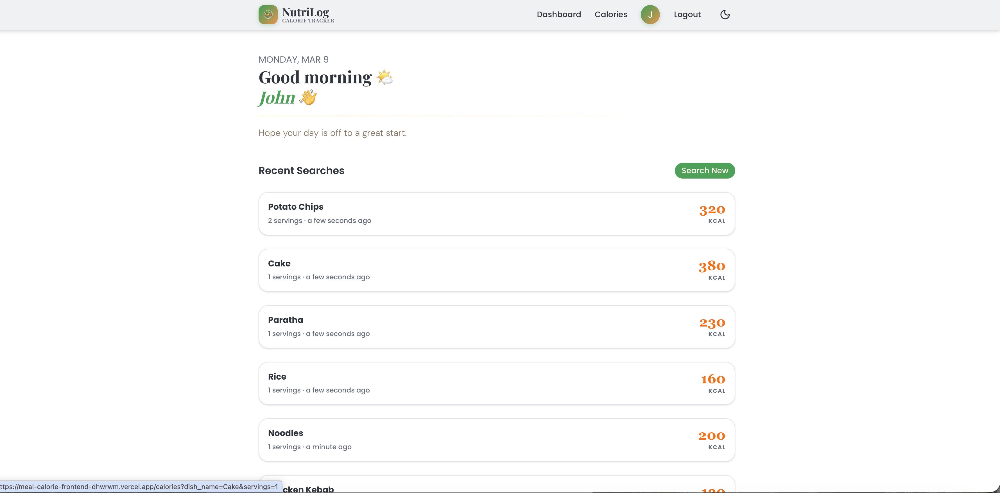
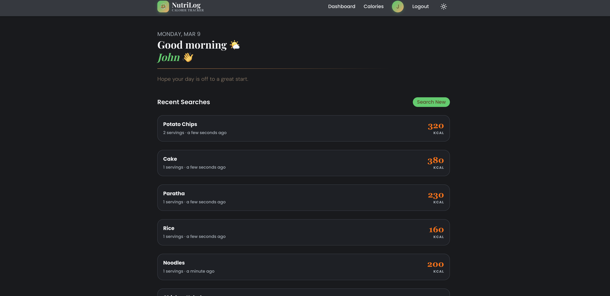
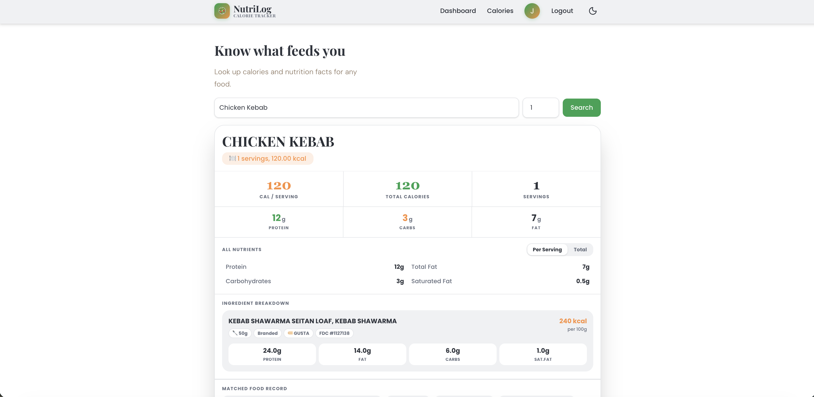
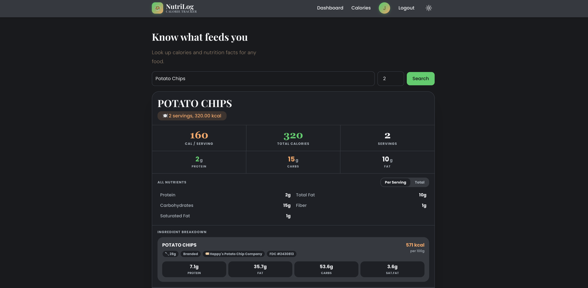
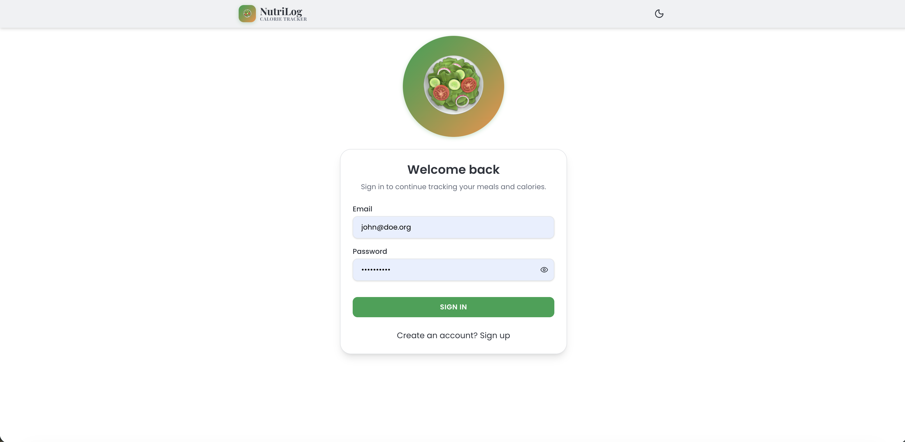
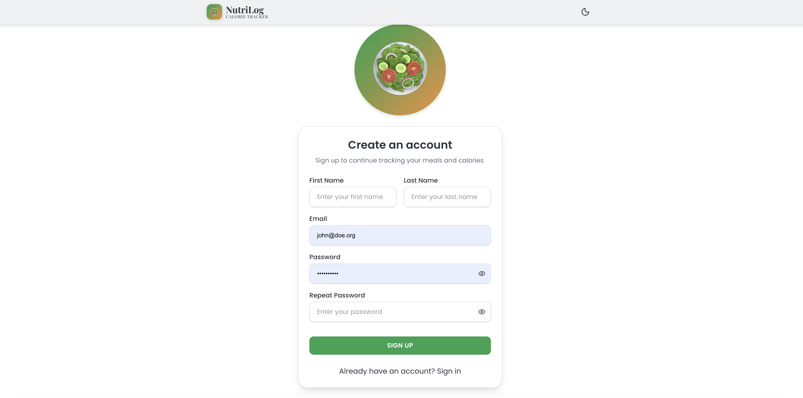
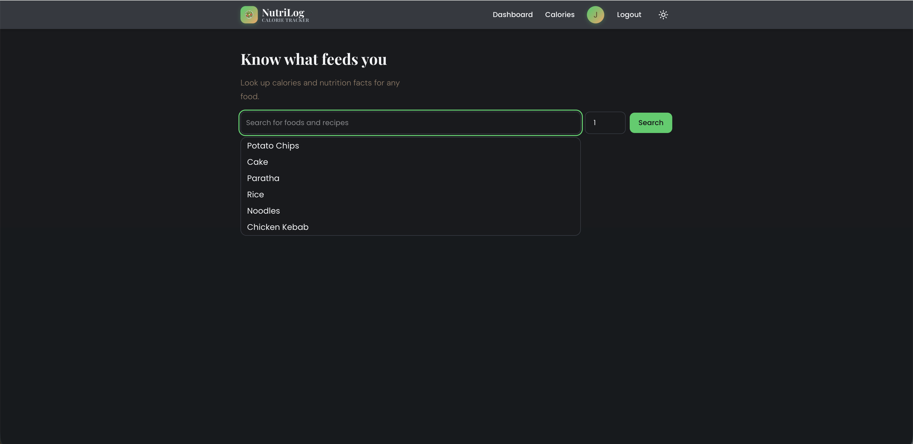
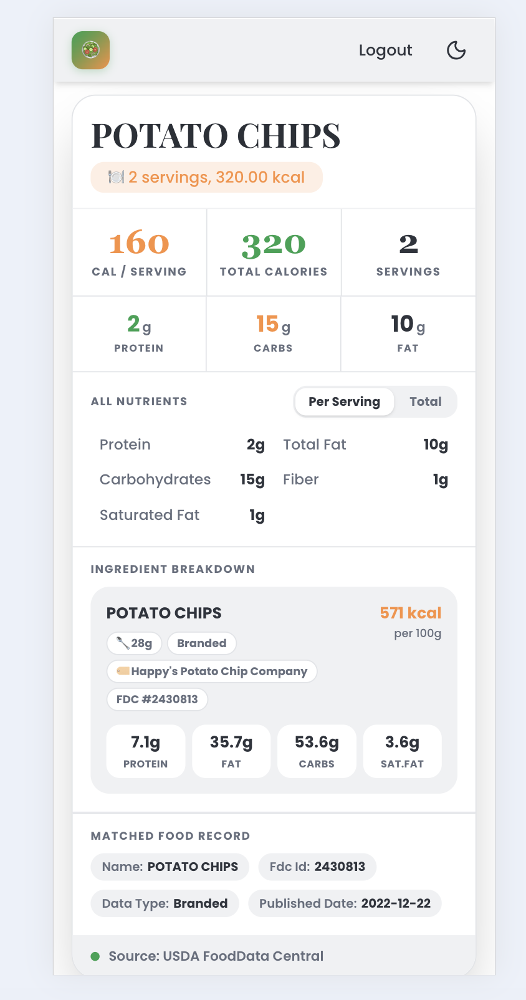
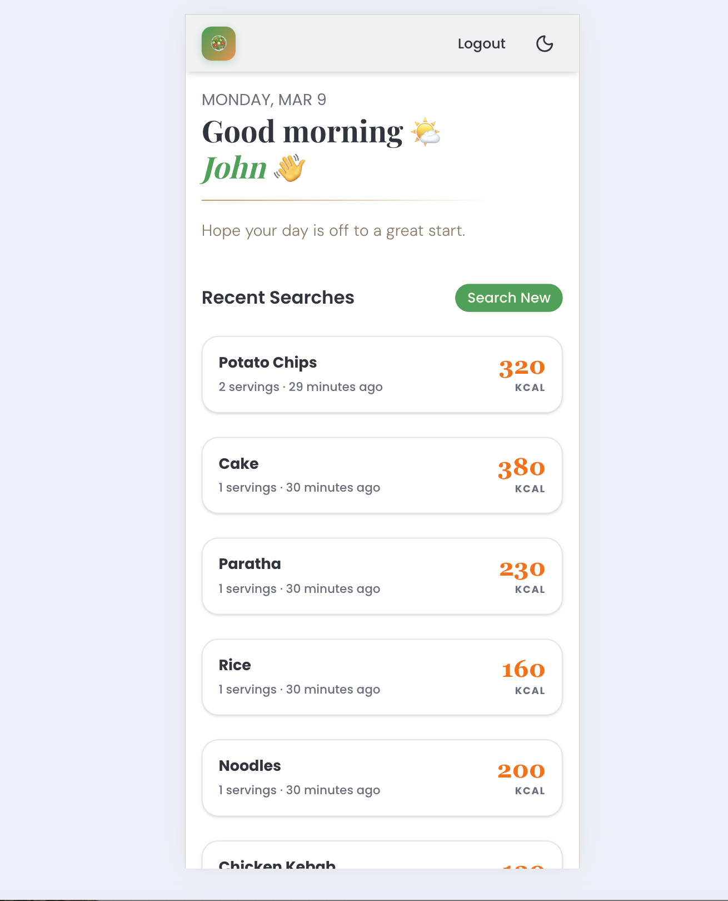

# NutriLog Web app 🥗

NutriLog is a calorie tracker that helps you track your daily calorie intake and meal calories. Built with **Next.js**, **TailwindCss**, and **Zustand** for state management. Users can search for meals and see total calories, macros, etc.

---

## 🌐 Hosted App

[View Live App](https://meal-calorie-frontend-dhwrwm.vercel.app/)

---

## ⚙️ Setup Instructions

1. **Clone the repo**

```bash
git clone https://github.com/your-username/calorie-web-app.git
cd calorie-web-app
```

2. **Install dependencies**

```bash
npm install
# or
yarn install
```

3. **Create `.env.local` file**
   Add your environment variables (example):

```env
NEXT_PUBLIC_API_BASE_URL=https://xpcc.devb.zeak.io
```

4. **Run the app in development**

```bash
npm run dev
# or
yarn dev
```

Open [http://localhost:3000](http://localhost:3000) in your browser.

6. **Build for production**

```bash
npm run build
npm start
# or
yarn build
yarn start
```

---

## 🛠️ Tech Decisions & Trade-offs

| Feature          | Tech Choice       | Trade-off / Reasoning                                                                                  |
| ---------------- | ----------------- | ------------------------------------------------------------------------------------------------------ |
| Framework        | Next.js           | Server-side rendering + static pages; slightly higher build complexity but better SEO and performance. |
| State Management | Zustand           | Lightweight and simple; less boilerplate than Redux, but lacks devtools and middleware options.        |
| Styling          | Tailwind CSS v4   | Fast styling and responsiveness; but may be verbose in JSX.                                            |
| API Handling     | Custom `apiFetch` | Centralized fetch with auth support; adds extra abstraction over fetch.                                |
| Hosting          | Vercel            | Easy deployment and previews; limited control over server-side features.                               |

---

## 💻 Screenshots

<!-- Replace the paths with actual screenshots -->











---

## 🔗 Links

- Repository: [GitHub](https://github.com/dhwrwm/meal-calorie-frontend-dhwrwm)
- Hosted App: [Live Demo](https://meal-calorie-frontend-dhwrwm.vercel.app/)
